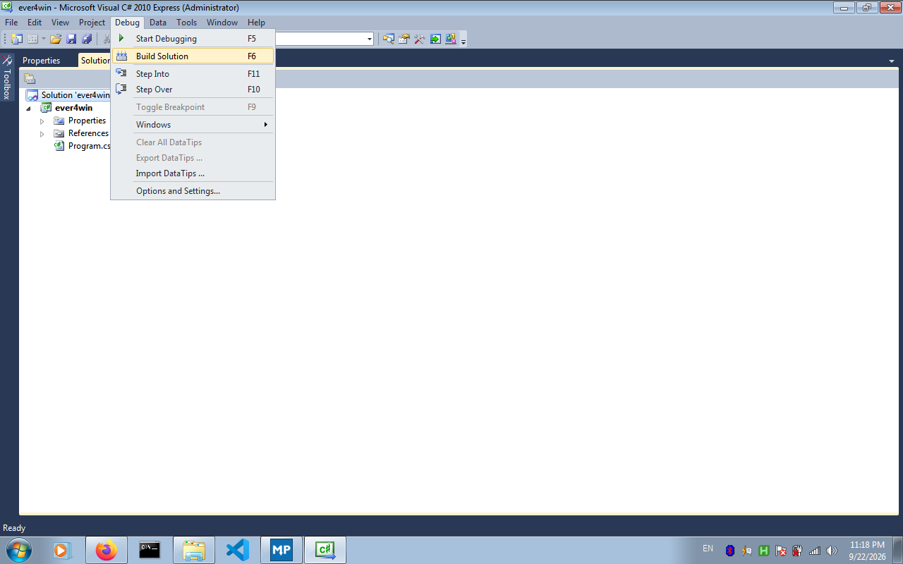
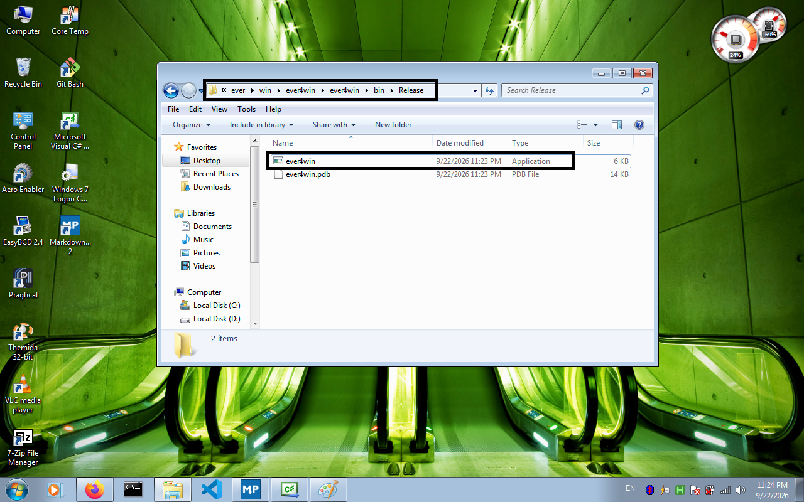
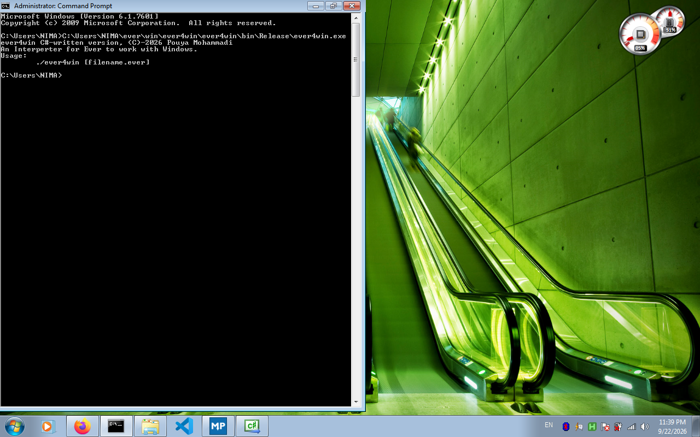
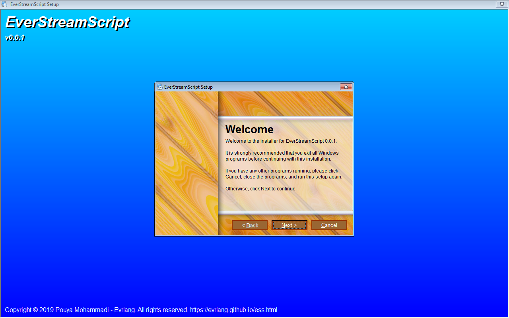

## Getting Started

> To perform the installation, the following tools must be installed on your system: 
> 
> 1. A C compiler capable of generating a standard dynamic library; preferably GCC.
> 
> 2. A compiler with DUB support and the ability to build libraries and compile D code—preferably DMD.
> 
> These are the requirements for the Linux version; for other interpreters, click the link for your system specifications.
> 
> [Windows](#Windows-Installation) 
> 
> If your operating system is not on this list, open an issue on GitHub.

### Before Start
> This guide is for Linux systems and may not work on some distributions. It was tested and worked well on Zorin OS 16.

`git clone https://github.com/evrlang/ever`

As the first step after cloning the source code from GitHub using the command above, navigate to the `cruntime` directory and execute the Makefile using the following command.

`make cbased`

Or just use the following command to build the runtime library.

`gcc -shared -fPIC -o libcbased.so cbased.c`

By now, you should have created the runtime file. This file is named `libcbased.so`. To ensure the linker finds it during the compilation stage, simply place it in `/usr/local/lib` and then run the following command to update the system's dynamic library cache.

`sudo ldconfig`

You are now ready to compile the interpreter. You must be connected to the internet so that the required libraries—which are automatically downloaded during the initial compilation stage—can be successfully installed.

### Start

Now, navigate to the `src` folder within the previous directory. This is where the interpreter's source code is located, organized in a modular fashion. Simply run `dub` to start the compilation process.

> Note that `dub` uses `dub.json` file as its configuration, and the final target specified within it is the `debug` build. By default—as is the case here—this configuration includes debugging symbols, which increase the final size of the interpreter.
> 
> However, you can edit the configuration file and compile it as a release.

Once the compilation process is complete, you can use `ever` by invoking it as described in the printed instructions. You may also run the examples located in the "examples" folder.

## Windows Installation

> For Windows, you need a C# compiler—preferably Visual C# 2010.
> 
> Naturally, you also need to download and install the prerequisites for Visual C# 2010.

There are two stable installation methods for Windows.

[Installation via graphical installer](#Installation-via-graphical-Installer) or 
[Compiling with Visual C#](#Compiling-with-Visual-CSharp)

## Compiling with Visual CSharp
### Before Start

Ensure that you have installed the .NET Framework and all the necessary tools for Visual C# 2010. You do not need a specific edition; the Express edition is sufficient to complete the compilation.

First, navigate to the following path from the root directory of the repository you cloned using Git.

Then, go to the following address: 

`win\ever4win\`

Simply click on the `ever4win.sln` file, and it will automatically open as a Visual C# solution.

Once Visual C# opens, compile the project by pressing F6, or go to the Debug tab and click on "Build Solution."

The build process has now started, and upon success, the output will be saved in the `win/ever4win/ever4win/bin/release/` folder.

Now, simply run this file in CMD to use it.

## Installation via graphical Installer
Download the installer file from the GitHub releases. Then, double-click it to open it, and you will see the following screen.

Follow the steps in the installer to complete the installation. Then, simply call `ever4win` from the command prompt (cmd).

## Your First Program

Open Notepad or a code editor and write the following code in it:

``
_write "Hello, World!"
``
> This guide assumes that you have already done some coding and possess programming experience.

1. An `_` must always precede the function name, serving as a marker so the lexer can identify it quickly and easily.
2. To pass an argument to a function, write it separated from the function name by a space—just like in Bash.
3. `write` itself adds a newline to the end of the string, and it is the equivalent of `writeln` in D.

The output will look something like this:

`C:\Users\POUYA> ever4win helloworld.ever`

`Hello, World!`

## Language Basics
> Each section has a link associated with it. Tap on it to open it.

1. An `_` must always precede the function name, serving as a marker so the lexer can identify it quickly and easily.
2. To pass an argument to a function, write it separated from the function name by a space—just like in Bash.
3. If you pass more than one argument to the function, you must open parentheses. `_mainWindow ("l1" "Hello World")`
4. Variable names begin with `@` so that the lexer can quickly recognize them, thereby increasing interpretation speed. `gen string @name "Pouya"`
5. The keyword `gen` is used to define anything other than `delegate`, signaling to the interpreter that a definition follows and preventing it from applying extraneous patterns. `gen int @a 1`
6. The keyword `end` is used to close a block; it is equivalent to `{`.